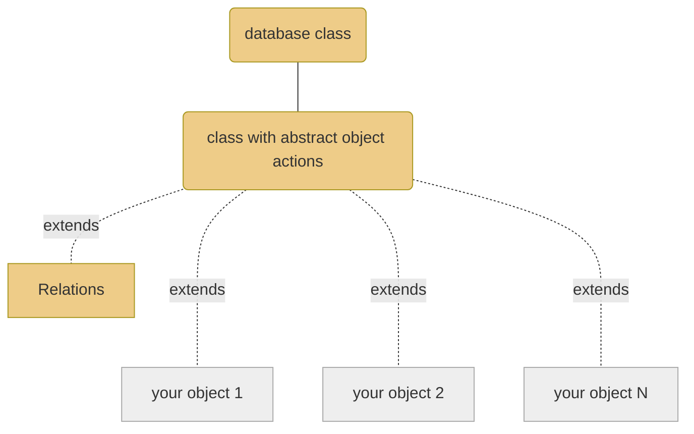

## Why

### Objects without sql

I wanted to write a database class that can handle any object with its custom properties. My objects should just set a value and store it.

Like that:

```php
$o->new();

$o->set('label', 'my label'); // set properties
$o->set('description', 'This is a nice description.');

$o->save(); // store to database
```

All needed database actions are handled in a base class. All objects just extend it.
There are some more features built in for logging, debugging, handle relations.

### Overview

This is the result of this project:



