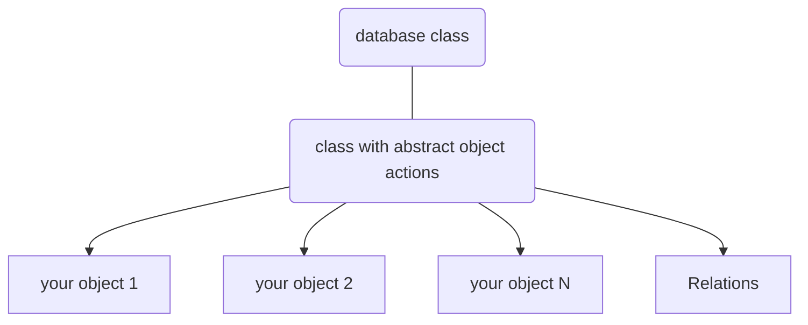

## Why

### Objects without sql

I wanted to write a database class that can handle any object with its custom properties. My objects should just set a value and store it.

Like that:

```php
$o->new();

// set properties
$o->set('label', 'my label');
$o->set('description', 'This is a nice description.');

// store to database
$o->save();
```

All needed database actions are handled in a base class. All objects just extend it.

### Debugging, logging

On top is a database class that handles database queries, logging, debugging and performance data.

### Relations

There is a global relation table that links all objects. This link is transparent for both objects.

### Overview

This is the result of this project:



